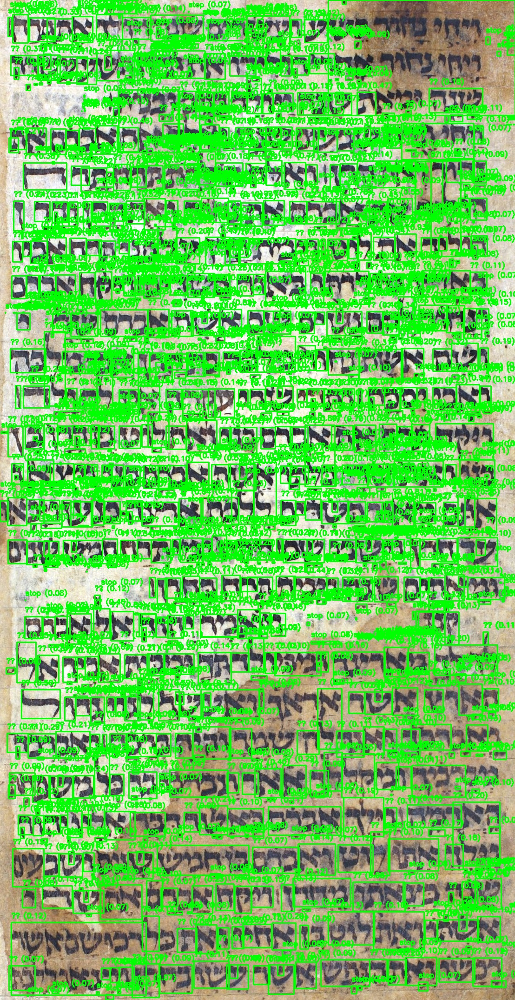

# Hebrew MNIST Dataset

## Purpose

This is a Jupyter Notebook to create a MNIST dataset for Hebrew letters in handwritten manuscripts.
The dataset is then used to autodetect Hebrew letters in the manuscripts. 

## Contact information
Benjamin Schnabel, 2024

[benjamin.schnabel@gmx.net](mailto:benjamin.schnabel@gmx.net)

[https://www.benjaminschnabel.de](https://www.benjaminschnabel.de)

# Requirements
* Python=3.9
* Tensorflow
* Keras
* Pandas
* Numpy
* Matplotlib
* opencv-python
* Pillow
* Jupyter Notebook

# Installation
Use conda and install Tensorflow.
I used tensorflow for Mac M1.

# Issues

Use github [issues](https://github.com/bsesic/hebrewmnist/issues).

# Running

Just run the Jupyter Notebooks.

1. [hebrew_letters_dataset.ipynb](hebrew_letters_dataset.ipynb) creates the dataset from the 
letters in the folder [hebrew_letters](hebrew_letters). The arranged by alphabet.
2. The result is the dataset. [hebrew_letter_model.keras](hebrew_letter_model.keras)
3. [letter_identification.ipynb](letter_identification.ipynb) is used to find the letter in 
the sample image. Use fine-tuning to adjust the values of the 
4. The Jupyter Notebook generates a [txt file](detected_letters.txt). It contains only the detected line by line.
5. There will also be an [Excel](detected_letters.xlsx) file generated with the detected letters.
The excel file contains the letter, its coordinates and the probability.
6. The result looks somewhat like this.

